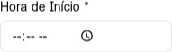

# Calendar Pro

Developed by: Rodrigo Marchi Gonella

Calendar Pro is a complete full-stack appointment management system built with React on the frontend and Node.js/Express with MongoDB on the backend.

Features

JWT Authentication: Secure user login and registration.

Appointment CRUD: Create, read, update, and delete events with date, time, and description.

Interactive Interface: Uses React Big Calendar for a modern and functional calendar view.

Modern Design: Frontend enhanced with Tailwind CSS and shadcn/ui components for a superior user experience.

Filters: Allows filtering appointments by status (“Completed” and “Pending”).

Visual Notifications: Uses React Toastify for visual user feedback.

Project Structure

The project is divided into two main folders: backend and frontend.

Backend (Node.js/Express/MongoDB)
File/Directory	Description
| :--- | :--- |
| `server.js` | Ponto de entrada da aplicação, configura o Express e a conexão com o MongoDB. |
| `.env` | Variáveis de ambiente (PORT, MONGODB\_URI, JWT\_SECRET). |
| `models/User.js` | Modelo Mongoose para o usuário (inclui hash de senha com `bcryptjs`). |
| `models/Event.js` | Modelo Mongoose para os compromissos. |
| `middleware/auth.js` | Middleware para verificação do token JWT. |
| `routes/auth.js` | Rotas de autenticação (`/register`, `/login`, `/me`). |
| `routes/events.js` | Rotas CRUD para os compromissos (inclui filtros por status e data). |

### Frontend (React)

File/Directory	Description
| :--- | :--- |
| `src/App.jsx` | Componente principal que gerencia o estado de autenticação e renderiza as telas de Login ou Calendário. |
| `src/contexts/AuthContext.jsx` | Contexto React para gerenciar o estado de autenticação e as funções de login/cadastro/logout. |
| `src/services/api.js` | Instância do Axios configurada com a URL base e interceptor para anexar o token JWT. |
| `src/services/eventService.js` | Funções para interagir com as rotas CRUD de eventos do backend. |
| `src/components/Login.jsx` | Componente para as telas de Login e Cadastro. |
| `src/components/Header.jsx` | Componente de cabeçalho exibido após o login. |
| `src/components/Calendar.jsx` | Componente principal do calendário, onde o `React Big Calendar` é renderizado e os eventos são gerenciados. |
| `src/components/EventModal.jsx` | Modal para criação e edição de eventos. |
| `src/utils/dateUtils.js` | Utilitários para formatação de datas usando `moment`. |
| `public/images/` | Contém as imagens de demonstração. |

## Local Installation Guide

Follow the steps below to set up and run the project locally.

Prerequisites

Node.js (v18+)

MongoDB (installed and running locally)

1. Clone the Repository
# This step is illustrative but would be the first in a real environment
# git clone <repository-url> calendar-pro
# cd calendar-pro

2. Backend Setup

Navigate to the backend folder and install dependencies:

cd backend
npm install

Create a .env file inside the backend folder with the following variables:

PORT=5000
MONGODB_URI=mongodb://localhost:27017/calendar-pro
JWT_SECRET=calendar_pro_jwt_secret_key_2024
NODE_ENV=development

Start the server:

npm run dev

The server will be running at http://localhost:5000.

3. Frontend Setup

Navigate to the frontend folder and install dependencies (using pnpm as in the template, but npm install also works):

cd ../frontend
pnpm install

Start the React application:

pnpm run dev --host

The app will be accessible at http://localhost:5173.

Screenshots (Enhanced Design)

Demo images are located in frontend/public/images/.

Login Screen

Calendar Screen

Event Registration Modal

Routes and Components Overview

Backend Routes

Method	Route	Description	Access

POST	/api/auth/register	Creates a new user.	Public
POST	/api/auth/login	Authenticates the user and returns a JWT token.	Public
GET	/api/auth/me	Returns the logged-in user’s data.	Private
GET	/api/events	Lists all user events (supports status, startDate, and endDate filters).	Private
POST	/api/events	Creates a new event.	Private
PUT	/api/events/:id	Updates an existing event.	Private
DELETE	/api/events/:id	Deletes an event.	Private
PATCH	/api/events/:id/status	Updates event status to “Completed” or “Pending”.	Private
Key Frontend Components

Component	Description

AuthContext	Manages global authentication state. Stores the JWT token in localStorage and automatically attaches it to API requests via Axios interceptor.
Login	Login and registration form component. Uses react-toastify for success/error messages.
Calendar	The core of the application. Manages event state, applies filters, and renders React Big Calendar. Includes a statistics panel.
EventModal	Modal form for event CRUD interface. Allows creating, editing, deleting, and updating appointment status with form validation.
eventService	Abstraction layer for API calls, simplifying backend communication.
Credits

Developed by Rodrigo Marchi Gonella.
