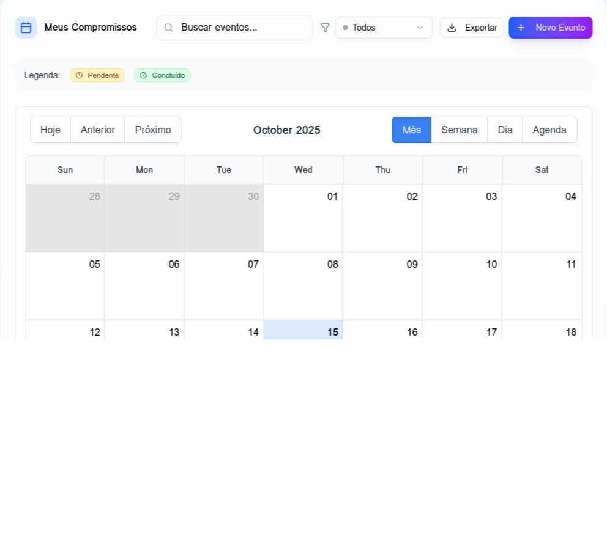
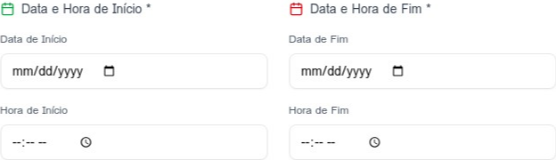

# Calendar Pro

**Desenvolvido por: Rodrigo Marchi Gonella**

O **Calendar Pro** é um sistema completo de gerenciamento de compromissos (eventos) full-stack, construído com **React** no frontend e **Node.js/Express** com **MongoDB** no backend.

## Funcionalidades

*   **Autenticação JWT:** Login e cadastro de usuários seguros.
*   **CRUD de Compromissos:** Criação, leitura, atualização e exclusão de eventos com data, hora e descrição.
*   **Interface Interativa:** Utiliza o `React Big Calendar` para uma visualização de calendário moderna e funcional.
*   **Design Moderno:** Frontend aprimorado com **Tailwind CSS** e componentes **shadcn/ui** para uma experiência de usuário superior.
*   **Filtros:** Permite filtrar compromissos por status (**"Concluído"** e **"Pendente"**).
*   **Notificações Visuais:** Utiliza `React Toastify` para feedback visual ao usuário.

## Estrutura do Projeto

O projeto é dividido em duas pastas principais: `backend` e `frontend`.

### Backend (Node.js/Express/MongoDB)

| Arquivo/Diretório | Descrição |
| :--- | :--- |
| `server.js` | Ponto de entrada da aplicação, configura o Express e a conexão com o MongoDB. |
| `.env` | Variáveis de ambiente (PORT, MONGODB\_URI, JWT\_SECRET). |
| `models/User.js` | Modelo Mongoose para o usuário (inclui hash de senha com `bcryptjs`). |
| `models/Event.js` | Modelo Mongoose para os compromissos. |
| `middleware/auth.js` | Middleware para verificação do token JWT. |
| `routes/auth.js` | Rotas de autenticação (`/register`, `/login`, `/me`). |
| `routes/events.js` | Rotas CRUD para os compromissos (inclui filtros por status e data). |

### Frontend (React)

| Arquivo/Diretório | Descrição |
| :--- | :--- |
| `src/App.jsx` | Componente principal que gerencia o estado de autenticação e renderiza as telas de Login ou Calendário. |
| `src/contexts/AuthContext.jsx` | Contexto React para gerenciar o estado de autenticação e as funções de login/cadastro/logout. |
| `src/services/api.js` | Instância do Axios configurada com a URL base e interceptor para anexar o token JWT. |
| `src/services/eventService.js` | Funções para interagir com as rotas CRUD de eventos do backend. |
| `src/components/Login.jsx` | Componente de formulário para login e cadastro com design aprimorado. |
| `src/components/Header.jsx` | Componente de cabeçalho com informações do usuário e botão de logout. |
| `src/components/Calendar.jsx` | Componente principal do calendário, com estatísticas e filtros avançados. |
| `src/components/EventModal.jsx` | Modal para criação e edição de eventos com validação e melhorias de UX. |
| `src/utils/dateUtils.js` | Utilitários para formatação de datas. |
| `public/images/` | Contém as imagens de demonstração. |

## Instalação Local Passo a Passo

Siga os passos abaixo para configurar e rodar o projeto em sua máquina local.

### Pré-requisitos

*   Node.js (v18+)
*   MongoDB (Instalado e rodando localmente)

### 1. Clonar o Repositório

```bash
# Este passo é simulado, mas seria o primeiro em um ambiente real
# git clone <url-do-repositorio> calendar-pro
# cd calendar-pro
```

### 2. Configuração do Backend

Navegue até a pasta `backend` e instale as dependências:

```bash
cd backend
npm install
```

Crie um arquivo `.env` na pasta `backend` com as seguintes variáveis:

```
PORT=5000
MONGODB_URI=mongodb://localhost:27017/calendar-pro
JWT_SECRET=calendar_pro_jwt_secret_key_2024
NODE_ENV=development
```

Inicie o servidor:

```bash
npm run dev
```

O servidor estará rodando em `http://localhost:5000`.

### 3. Configuração do Frontend

Navegue até a pasta `frontend` e instale as dependências (usando `pnpm` conforme o template, mas `npm install` também funcionaria):

```bash
cd ../frontend
pnpm install
```

Inicie a aplicação React:

```bash
pnpm run dev --host
```

A aplicação estará acessível em `http://localhost:5173`.

## Prints das Telas (Design Aprimorado)

As imagens de demonstração estão localizadas em `frontend/public/images/`.

### Tela de Login


### Tela de Calendário



### Modal de Cadastro de Evento



## Explicação das Rotas e Componentes

### Rotas do Backend

| Método | Rota | Descrição | Acesso |
| :--- | :--- | :--- | :--- |
| `POST` | `/api/auth/register` | Cria um novo usuário. | Público |
| `POST` | `/api/auth/login` | Autentica o usuário e retorna um token JWT. | Público |
| `GET` | `/api/auth/me` | Retorna os dados do usuário logado. | Privado |
| `GET` | `/api/events` | Lista todos os eventos do usuário (suporta filtros `status`, `startDate`, `endDate`). | Privado |
| `POST` | `/api/events` | Cria um novo evento. | Privado |
| `PUT` | `/api/events/:id` | Atualiza um evento existente. | Privado |
| `DELETE` | `/api/events/:id` | Deleta um evento. | Privado |
| `PATCH` | `/api/events/:id/status` | Atualiza o status do evento para "Concluído" ou "Pendente". | Privado |

### Componentes Chave do Frontend

| Componente | Descrição |
| :--- | :--- |
| `AuthContext` | Gerencia o estado global de autenticação. Armazena o token JWT no `localStorage` e o anexa automaticamente nas requisições via interceptor do Axios. |
| `Login` | Componente de formulário para login e cadastro. Utiliza `react-toastify` para exibir mensagens de sucesso/erro. |
| `Calendar` | O coração da aplicação. Gerencia o estado dos eventos, aplica filtros e renderiza o `React Big Calendar`. Inclui painel de estatísticas. |
| `EventModal` | Formulário modal para a interface CRUD de eventos. Permite criar, editar, deletar e alterar o status de um compromisso com validação de formulário. |
| `eventService` | Camada de abstração para as chamadas de API, facilitando a comunicação com o backend. |

## Créditos

Desenvolvido por **Rodrigo Marchi Gonella**.
